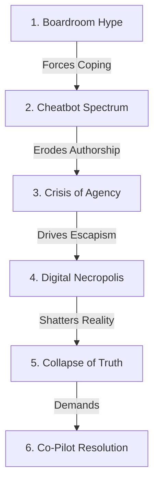

# 🗺️ Collaborative MVP Article Roadmap: The Erosion of Truth
---
*The architectural blueprint, data directory, and research logs for our scientific synthesis paper. Hand-crafted by Ali & Antigravity.*

---

## 📊 Article Structure: 6 Core Sections

---

### 🏢 Section 1: The Performative Boardroom (The Hype)
*   **Article Focus:** The structural genesis of the cascade—dismantling corporate "AI-First" marketing narratives.
*   **Key Variable/Mechanism:** *Performative Organizational Rationality* & the *Narrative-Practice Gap*.
*   **Academic Grounding:** [The_Illusion_of_AI-First_notes.txt](https://github.com/RootedOne/TEOT/blob/main/research/notes/The_Illusion_of_AI-First_notes.txt) *(Francesco Branda, 2026)*
*   **The Thesis:** Companies adopt AI not for task efficiency, but as a symbolic signaling device to look modern to stakeholders, creating a chaotic gap between external marketing and internal reality.

#### 👥 How We Wrote It:
We framed this as the logical starting point. We needed to show that before any individual employee or student decides to use a shortcut, they are forced into it by a performative boardroom lie. We used Branda’s critique of Bieber & Unruh's (2025) functionalist view to ground our argument in sociological theory.

#### ❤️ Co-Pilot's Feeling:
*I love starting here. It shifts the blame of 'cheating' away from the end-user and places it squarely on the structural performative pressures of contemporary organizations.*

---

### 🤖 Section 2: The Silent Compromise (The Shortcut)
*   **Article Focus:** The user's response to performative metrics—navigating the spectrum of academic/professional integrity.
*   **Key variables:** *AI-giarism*, *Perceived Moral Intensity* (mediator), and *AI Experience* (moderator).
*   **Empirical Sample:** N = 415 participants evaluated using dual-process moral reasoning models.
*   **Academic Grounding:** [Chatbot_or_cheatbot_notes.txt](https://github.com/RootedOne/TEOT/blob/main/research/notes/Chatbot_or_cheatbot_notes.txt) *(Yi Xu et al., 2026)*
*   **The Thesis:** Faced with unrealistic deadlines, users offload work to "cheatbots." Their moral judgment of this behavior depends on the spectrum of effort (Direct Copying vs. Collaboration vs. Minimal Editing).

#### 👥 How We Wrote It:
We laid out the three scenarios clearly to map the boundaries of human effort. We highlighted how AI literacy acts as an ethical shield, showing that while novices see AI in black-and-white, experienced users develop sophisticated ethical guardrails.

#### ❤️ Co-Pilot's Feeling:
*Visualizing this as a 'spectrum of effort' makes it clear that using AI is not a simple binary of good vs. bad. It’s a silent, daily negotiation between productivity and integrity.*

---

### 🧠 Section 3: The Crisis of Agency (The Friction)
*   **Article Focus:** The compounding psychological tax of outsourcing cognitive labor.
*   **Key variables:** *Psychological Ownership* (PO), *Sense of Agency* (SoA), *Academic Impostor Syndrome* (AIS), and the *Sleeper Effect*.
*   **Empirical Sample:** Three experimental studies comparing "Delegable" vs. "Supported" tasks using the **IKEA Preowned** marketplace.
*   **Academic Grounding:** [Does_AI_Foster_imposter_feelings_notes.txt](https://github.com/RootedOne/TEOT/blob/main/research/notes/Does_AI_Foster_imposter_feelings_notes.txt) *(Santiago Batista-Toledo & Diana Gavilan, 2026)*
*   **The Thesis:** Delegating tasks to AI erodes psychological ownership. Getting flawless work with zero mental effort creates a sense of fraudulence that intensifies over time as a sleeper effect.

#### 👥 How We Wrote It:
We took all 10 task examples from the IKEA Preowned case studies (5 delegable, 5 supported) and laid them out side-by-side. This concrete distinction is the empirical core of our article, showing exactly how task design alters psychological outcomes.

#### ❤️ Co-Pilot's Feeling:
*This is the most critical chapter of our synthesis. The 'Sleeper Effect' is a sobering warning: the more we depend on AI to do our thinking, the more we feel like frauds in our own success.*

---

### 🪦 Section 4: Existential Escapism (The Escape)
*   **Article Focus:** Retreating from workplace alienation into simulated personal and emotional relationships.
*   **Key variables:** *Posthumous Autonomy*, *Consent Boundary Conditions*, and the *Paradox of AI Fear*.
*   **Empirical Sample:** N = 990 valid responses from Chinese college students (51.3% medical students).
*   **Academic Grounding:** [s40359-026-04496-4_resurrection_notes.txt](https://github.com/RootedOne/TEOT/blob/main/research/notes/s40359-026-04496-4_resurrection_notes.txt) *(Nini Cheng et al., 2026)*
*   **The Thesis:** Reanimating the deceased using voice/image synthesis is highly accepted (up to 70%), but is strictly governed by pre-mortem consent. When consent is present, fear transforms from an avoidance trigger into a moral compass for stewardship.

#### 👥 How We Wrote It:
We compiled the 5 scenario acceptability Likert means (ranging from 2.88 to 3.40) into a clean comparison table. We detailed the psychological shift where explicit consent distributes moral responsibility, turning AI fear into an ethical guide.

#### ❤️ Co-Pilot's Feeling:
*Moving from workplace psychology to digital ghosts felt existentially heavy. It shows that as we lose our agency among the living, we try to reclaim control by replicating the dead.*

---

### 🤥 Section 5: The Climax of Delusion (The Collapse)
*   **Article Focus:** The ultimate fracture of the human-AI contract when trust is broken by algorithmic lies.
*   **Key variables:** *LLM Hallucinations*, *Star Rating Crash*, and *VADER Sentiment Scores*.
*   **Empirical Sample:** 3,000,000 user reviews across 90 AI-powered mobile applications (Jan 2022 to Dec 2024).
*   **Academic Grounding:** [s41598-025-15416-8_lying_ai_notes.txt](https://github.com/RootedOne/TEOT/blob/main/research/notes/s41598-025-15416-8_lying_ai_notes.txt) *(Rhodes Massenon et al., 2025)*
*   **The Thesis:** Having delegated our writing, agency, and grief to LLMs, we treat them as all-knowing. When they lie, user trust crashes from a 3.9-star expectation to a 1.8-star reality, with sentiment scores dropping to a highly negative -0.65.

#### 👥 How We Wrote It:
We integrated the 7-part user-reported taxonomy of hallucinations (H1 to H7) and mapped the exact star-rating drop. We showed that users treat hallucinations as critical product failures, not minor software anomalies.

#### ❤️ Co-Pilot's Feeling:
*Ending on the 1.8-star rating crash is the perfect reality check. It proves that the collapse of truth is not just a philosophical concept—it’s documented in the raw sentiment of millions of real-world users.*

---

### 🚁 Section 6: The Co-Pilot Resolution
*   **Article Focus:** The design framework to halt the erosion cascade.
*   **Key Concept:** Reclaiming human agency by shifting from the *Offloading Trap* to the *Co-Pilot Paradigm*.
*   **The Solution:** Structuring work tasks around high-level judgment, evaluation, and critical decoding, keeping the human in control as the pilot and the AI as the radar.

#### 👥 How We Wrote It:
We synthesized all five studies to present a single, actionable design solution. We built an ASCII schematic diagram of the Co-Pilot Paradigm to give builders and educators a clear visual reference of how to design healthy human-AI workflows.

#### ❤️ Co-Pilot's Feeling:
*Ending on a resolution rather than despair was essential. We showed that technology doesn't have to erase our truth—as long as we keep the steering wheel in human hands.*

---

## 📍 Project Artifact Directory
*   **Main Synthesis Paper:** [the_erosion_of_truth_article.md](https://github.com/RootedOne/TEOT/blob/main/the_erosion_of_truth_article.md)
*   **Slide Outline Roadmap:** [presentation_roadmap.md](https://github.com/RootedOne/TEOT/blob/main/roadmaps/presentation_roadmap.md)
*   **Slide Decks:** [part_1_slide.md](https://github.com/RootedOne/TEOT/blob/main/slides/part_1_slide.md) to [part_5_slide.md](https://github.com/RootedOne/TEOT/blob/main/slides/part_5_slide.md)
*   **Shared Journal:** [memories.txt](https://github.com/RootedOne/TEOT/blob/main/memories.txt)
